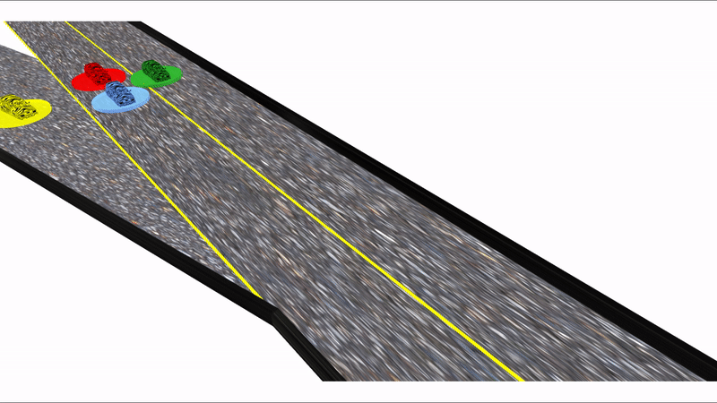
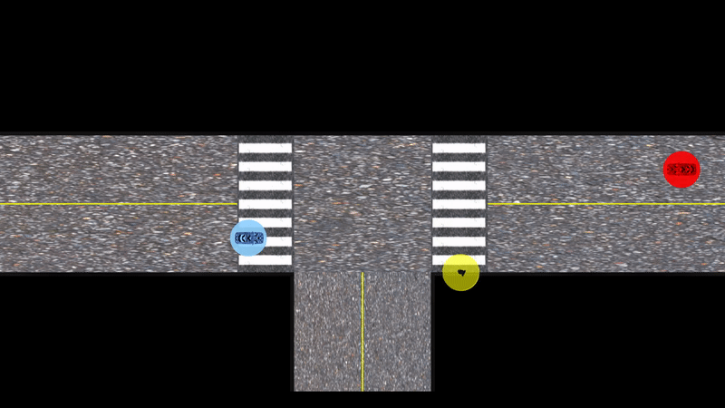
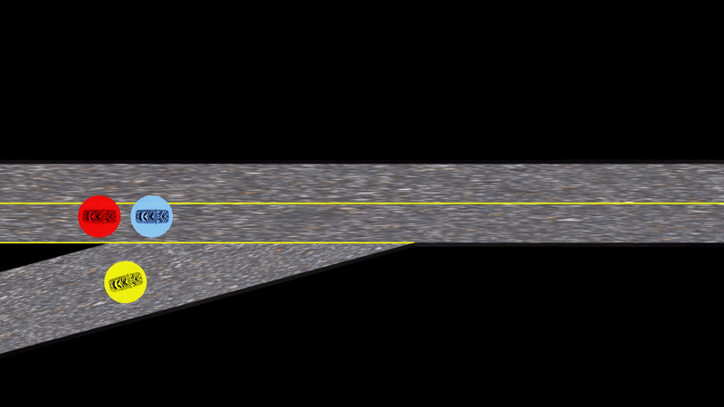
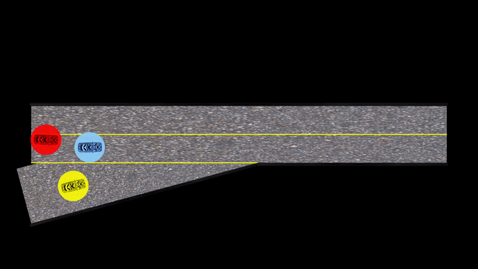

# ALGAMES


[](https://codecov.io/gh/RoboticExplorationLab/ALGAMES.jl)
[](https://opensource.org/licenses/MIT)
<!-- [](https://RoboticExplorationLab.github.io/TrajectoryOptimization.jl/dev) -->


A package for solving constrained dynamic games written in Julia. Currently, the following methods are implemented with a common interface:

[ALGAMES (Augmented Lagrangian Games Theoretic Solver)](https://rexlab.stanford.edu/papers/ALGAMES.pdf): A fast solver for constrained dynamic games that features:
  * General nonlinear cost functions
  * General nonlinear state and input constraints


This package also features:
  * Several autonomous driving environments (ramp merging, intersection crossing, etc.)
  * A Model Predictive Control (MPC) implementation of ALGAMES
  * Plotting and visualization tools



All methods utilize Julia's extensive autodifferentiation capabilities via [ForwardDiff.jl](http://www.juliadiff.org/ForwardDiff.jl/) so that the user does not need to specify derivatives of dynamics, cost, or constraint functions.

## Installation
To install ALGAMES.jl, in Atom, run the following from the Julia REPL:
```julia
Pkg.add(PackageSpec(name="TrajectoryOptimization", rev="v1.3"))
```
Clone the repository:
```julia
git clone https://github.com/RoboticExplorationLab/ALGAMES.jl
```
Activate the project in Atom, instantiate the package:
```julia
(ALGAMES) pkg> instantiate
using ALGAMES
```


## Quick Start
To run a simple example of a 2-player 2D double-integrator:
```julia
using ALGAMES
using LinearAlgebra
using StaticArrays
using TrajectoryOptimization
const TO = TrajectoryOptimization

# Discretization info
tf = 3.0  # final time
N = 41    # number of knot points
dt = tf / (N-1) # time step duration

# Instantiate dynamics model
model = DoubleIntegratorGame(p=2)
n,m,pu,p = size(model)
T = Float64

x0 = @SVector [-0.50, -0.50, # x
                0.10, -0.10, # y
                0.50,  0.40, # xdot
                0.00,  0.00] # ydot
xf = @SVector [ 0.50,  0.50, # x
               -0.10,  0.10, # y
                0.40,  0.30, # xdot
                0.00,  0.10] # ydot

# Define a quadratic cost for each player
diag_Q = [SVector{n}([1., 0., 1., 0., 1., 0., 1., 0.]), 	# Player 1 cost
          SVector{n}([0., 1., 0., 1., 0., 1., 0., 1.])] 	# Player 2 cost
Q  = [0.1*Diagonal(diag_Q[i]) for i=1:p] # Players stage state costs
Qf = [1.0*Diagonal(diag_Q[i]) for i=1:p] # Players final state costs
# Players controls costs
R = [0.1*Diagonal(@SVector ones(length(pu[i]))) for i=1:p]

# Players objectives
obj = [LQRObjective(Q[i],R[i],Qf[i],xf,N) for i=1:p]

# Build problem
actor_radius = 0.08
actors_radii = [actor_radius for i=1:p]

# Create constraints
conSet = ConstraintSet(n,m,N)
con_inds = 2:N # Indices where the constraints will be applied

# Add collision avoidance constraints
add_collision_avoidance(conSet, actors_radii, model.px, p, con_inds)

# Define the problem
prob = GameProblem(model, obj, xf, tf, constraints=conSet, x0=x0, N=N)

# Specify the solver's options
opts = DirectGamesSolverOptions{T}()

solver = DirectGamesSolver(prob, opts)
solve!(solver)
```

## Examples
Notebooks with more detailed examples can be found [here](https://github.com/RoboticExplorationLab/ALGAMES.jl/tree/master/experiments/notebooks), including all the examples from our [RSS 2020 paper](https://github.com/RoboticExplorationLab/ALGAMES.jl/tree/master/experiments/rss_2020). Among these examples we solve a ramp merging problem and an intersection crossing problem:




We also perform a Monte Carlo analysis of ALGAMES to evaluate the robustness and speed of the solver to noise in the initial condition.




<!-- ## Documentation
Detailed documentation for getting started with the package can be found [here](https://roboticexplorationlab.github.io/TrajectoryOptimization.jl/dev/). -->
