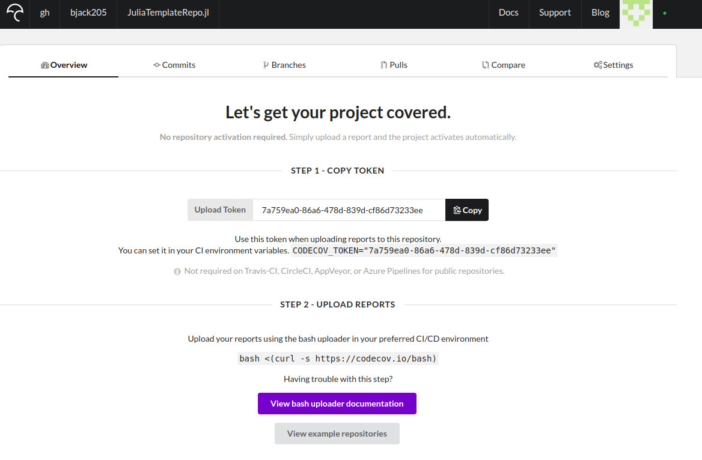
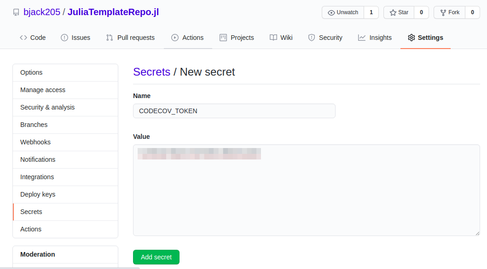

# Adding Code Coverage
This section will detail how to get code coverage reports via
[codecov.io](https://codecov.io/).

1. Go to [codecov.io](https://codecov.io/) and log in.

2. In GitHub, add your repo in the CodeCov App settings. If you haven't set up codecov for
    your organization or account, configure it via the [GitHub App](https://github.com/apps/codecov).
    

3. In codecov.io, select the parent organization or account and select "Add new repository".
    If your repo doesn't show up, you can navigate directly to it in the URL bar, e.g.
    https://codecov.io/gh/bjack205/Algames.jl.

4. Copy the codecov token
    

5. Add token to GitHub secrets. In GitHub, navigate to the settings for your repo, select
    "Secrets" from the toolbar on the left, and select "New Secret". Name the token `CODECOV_TOKEN`
    and copy the token from codecov.io.
    

6. Add the badge to your README. You can get a link to your badge by going to Settings in
    codecov.io, selecting Badge from the right-hand side, and copying the Markdown link.
    
