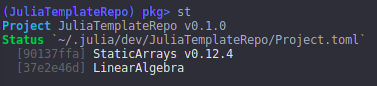

# Adding Dependencies
Any registered package used by our new repo must be recorded in the `Project.toml` file.
The easiest way to add packages is via the package manger. For our package, we are going
to add [StaticArrays.jl](https://github.com/JuliaArrays/StaticArrays.jl) and LinearAlgebra
as dependencies.

To do this, we need to first activate the `Project.toml` file for our project using the
package manager:
```julia
] activate /path/to/Algames
```

Once activated, we add dependencies the exact same way we do normally:
```
(Algames) pkg> add StaticArrays
(Algames) pkg> add LinearAlgebra
(Algames) pkg> resolve
```

The last command isn't always needed, but is recommended, since it updates our `Manifest.toml`
file based on the contents of the `Project.toml` file.

If we open our `Project.toml` file we should now see our packages under the `[deps]` header:
```
name = "Algames"
uuid = "bfba84be-7fa7-49e4-96a7-8b4754465918"
authors = ["Brian Jackson <bjack205@gmail.com>"]
version = "0.1.0"

[deps]
LinearAlgebra = "37e2e46d-f89d-539d-b4ee-838fcccc9c8e"
StaticArrays = "90137ffa-7385-5640-81b9-e52037218182"
```

We now need to specify the versions of the non-standard packages we officially support.
The easiest---and more conservative---way to determine our compatibility is to restrict
the versions to those that are currently being used. We can query this using the package
manager:
```
(Algames) pkg> st
```
Which should return something like



Here we see that LinearAlgebra is a part of the standard library since it doesn't have an
associated version, and that we're using `StaticArrays` `v0.12.4`. Since all patches should
be backward-compatible, we will allow any of the `v0.12.x` versions of StaticArrays.

We add this compatibility requirement, along with our required Julia version, to the
`[compat]` section of our `Project.toml` file:

```
name = "Algames"
uuid = "bfba84be-7fa7-49e4-96a7-8b4754465918"
authors = ["Brian Jackson <bjack205@gmail.com>"]
version = "0.1.0"

[deps]
LinearAlgebra = "37e2e46d-f89d-539d-b4ee-838fcccc9c8e"
StaticArrays = "90137ffa-7385-5640-81b9-e52037218182"

[compat]
StaticArrays = "0.12"
julia = "1"
```

The Julia package registrator requires that all packages have upper-bounded compatibility
requirements.

Before committing our `Project.toml` file, we need to make sure our `Manifest.toml` file
isn't included in our repo, since this file is dependent on the environment of the user.
Add `Manifest.toml` to your `.gitignore` file.
