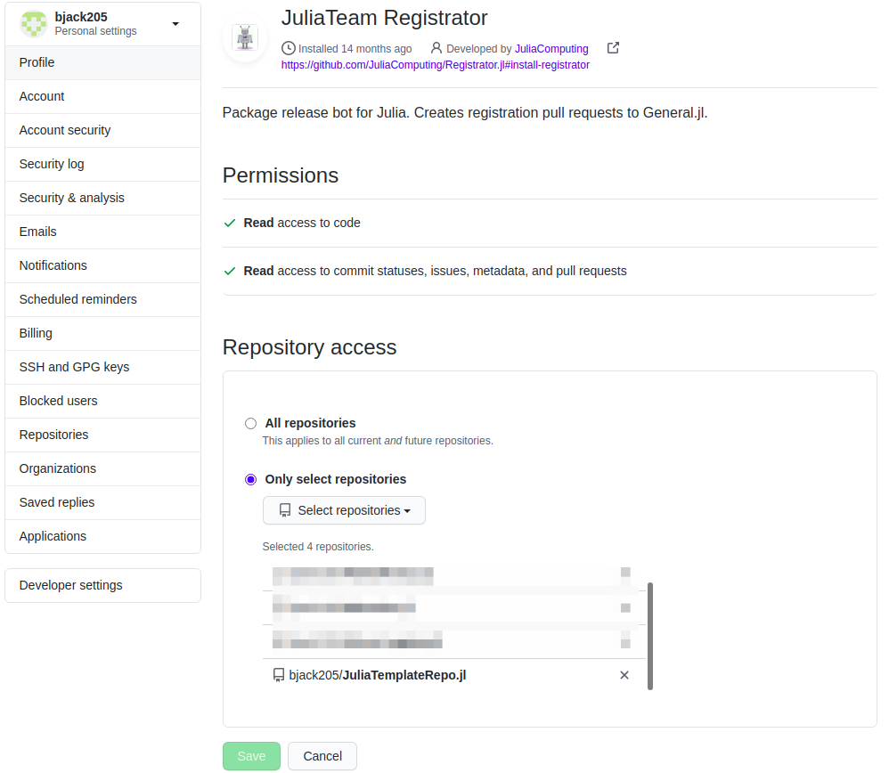
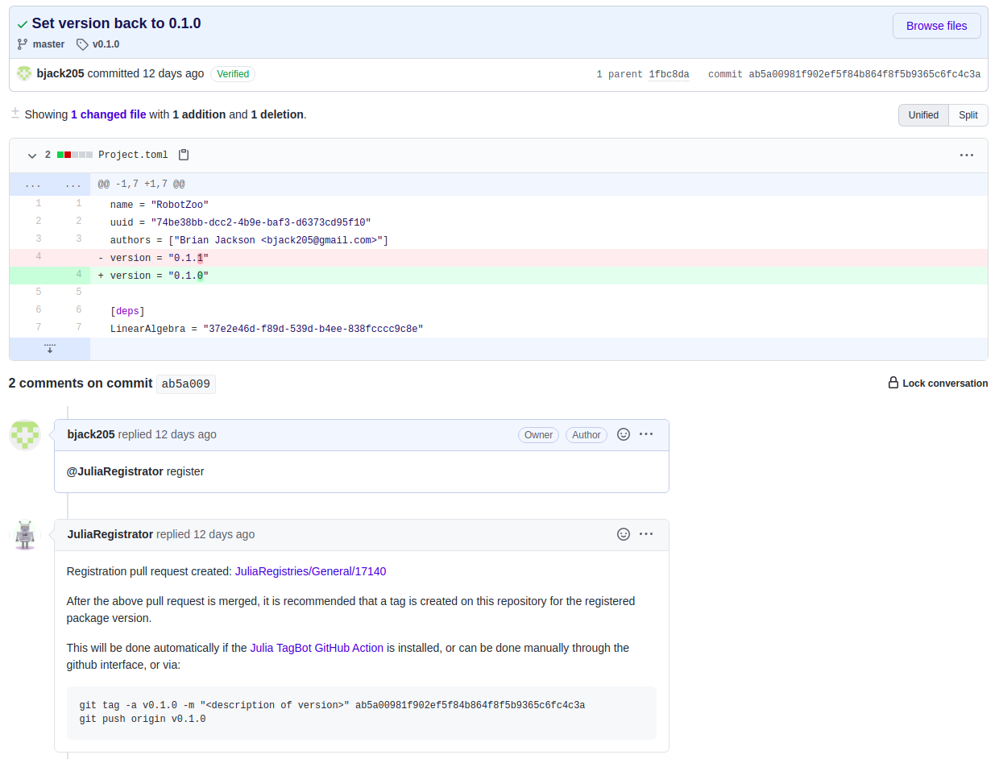

# Registering Your Package
Registering a package with the Julia
[general  registry](https://github.com/JuliaRegistries/General) is pretty straight forward.o

To register a new release, follow the exact same process (skipping step 1 since you'll
already have JuliaRegistrator installed).

### 1. Add JuliaRegistrator
Add [JuliaRegistrator](https://github.com/JuliaRegistries/Registrator.jl#install-registrator) to your repo. Follow the instructions
in the repo. You should arrive at a screen that looks like the image
below for your user/organization settings. Add your new repo.



### 2. Verify the version
The version is set by your `Project.toml`. In the example below, the version is `v0.1.0`. By default, most new repositories should be `v0.1.0`.

```
name = "Algames"
uuid = "bfba84be-7fa7-49e4-96a7-8b4754465918"
authors = ["Brian Jackson <bjack205@gmail.com>"]
version = "0.1.0"

[deps]
LinearAlgebra = "37e2e46d-f89d-539d-b4ee-838fcccc9c8e"
StaticArrays = "90137ffa-7385-5640-81b9-e52037218182"

[compat]
StaticArrays = "0.12"
julia = "1"
```

### 3. Use JuliaRegistrator
Comment `@JuliaRegistrator register` on the commit/branch you would like to register.
This can be done either by a) creating a new issue and commenting in the issue
(top image below), or b) commenting on a commit (bottom image below).

#### New Issue


#### Comment on a commit


### 4. Check the pull request
Check the status of the pull request on JuliaRegistries/General (link is in the auto-generated
comment below yours) to see if it passes the rules for auto-merging. If it fails, make
the fixes and make a new comment with `@JuliaRegistrator register`. It
will simply modify the previous pull request.

### 5. Create a Release
If you have [TagBot](@ref) installed, you're good to go! Otherwise, create a release with
the new version in GitHub.
